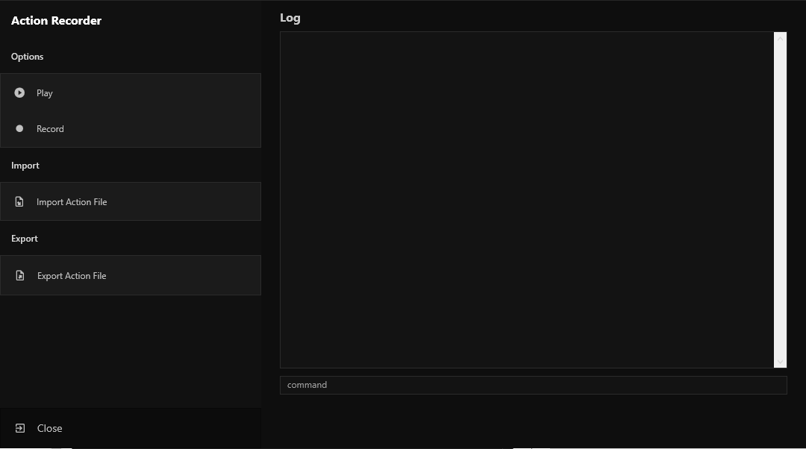
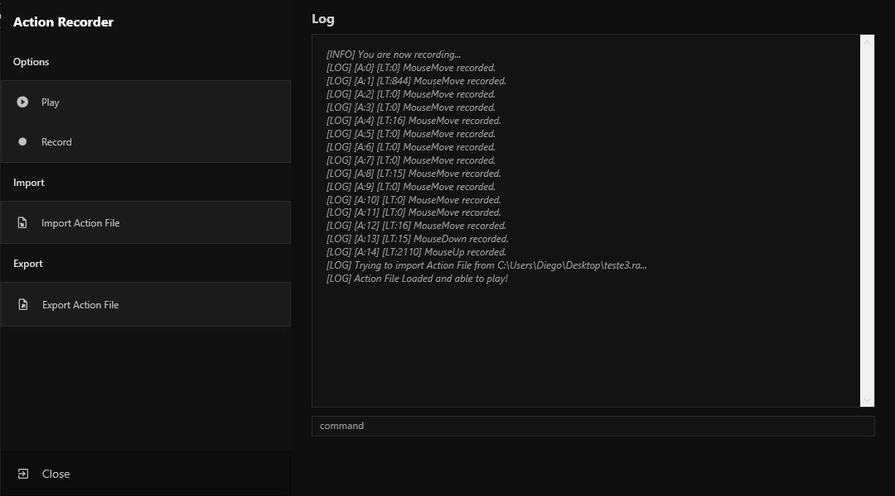

# Action Recorder

Hi, I hope you all are well!

This is a project for creating a macro, aimed at those who need to automate some repetitive tasks.

The idea came from a personal need and I didn't like the ones I found for my purpose, the development of my own application was so pleasant that I decided to make it available to everyone.

The project is currently meeting the initial requirement, and I've now also reached the point of starting the step of refactoring some parts to improve the porformance, so keep following the development and put it to good use.

## Screenshots

#### Initial Screen

#### Actions Recorded and Imported Action File.

## Features

- Record keyboard and cursor actions.
- Record actions to play in loop using ``loop [args]`` command.
- Play or stop previous or imported actions recorded.
- Fully open-source.
- Export or import recorded actions.
- Clear log console using ``clear`` command.
- Modern UI design made with ❤.

## Next to-do list
[ ] Responsive window width/height for diferent screens.
[ ] Optimization when recording action.

## Feedback

If you have any feedback, please reach out to us at diegosantosaraujo@outlook.com

## License

[MIT](https://choosealicense.com/licenses/mit/)

