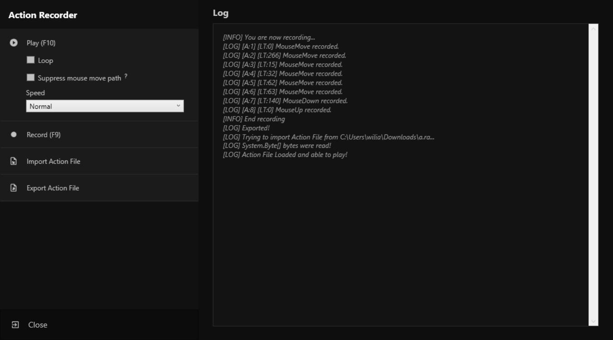

# Action Recorder

Hi, I hope you all are well!

This is a project for creating a macro, aimed at those who need to automate some repetitive tasks.

## Screenshot

## Features

- Record keyboard and mouse actions.
- Playback recorded actions.
- Export/import record to a file.
- Reproduce it indefinitely by using the "Loop" option.
- Reproduce ignoring all mouse move actions without any key pressed by using the "Suppress mouse move path" option.
- Control the speed of reproduction using a multiplier or setting a fixed time.

## Next to-do list
- [ ] Migrate to latest .NET version and use UWP.
- [ ] Logging is not impacting too much on performance, but it is still a problem, it still cannot log in real-time.

## License

[MIT](https://choosealicense.com/licenses/mit/)
